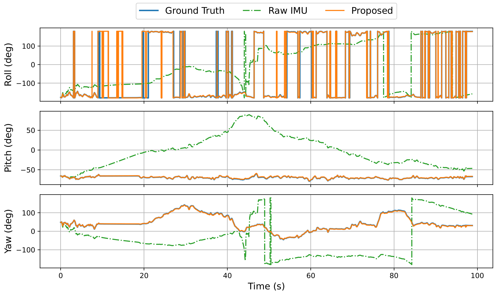
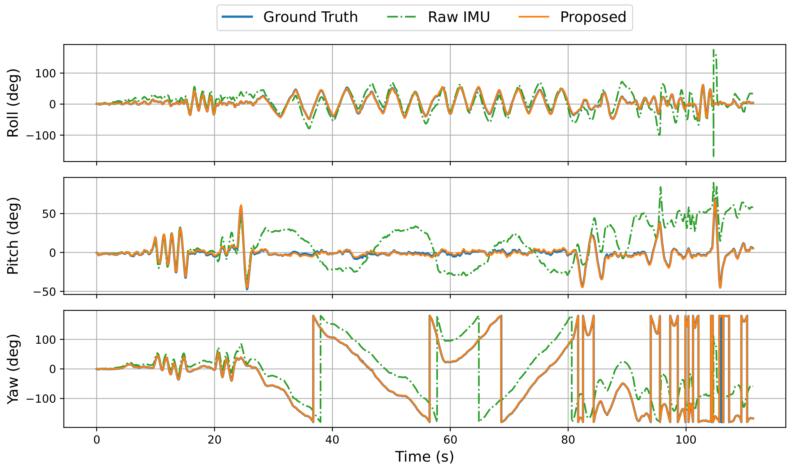

# IMU Debiasing

## Overview
This project focuses on debiasing (denoising) Inertial Measurement Unit (IMU) data, including gyroscope and accelerometer measurements. A neural network explicitly models the bias dynamics, while a neural ODE on $SO(3)$ is designed for training. The loss is computed using ground truth orientation, velocity, and position, without requiring ground truth for bias.

The overall framework is illustrated below:


<figure>
  
  <figcaption>Figure 1: The hierarchical neural ODE framework.</figcaption>
</figure>

### Paper
This work has been accepted at RSS, 2025. You can find the arXiv version [here](https://arxiv.org/abs/2504.09495).

## Setup

### Create a Virtual Environment
To ensure an isolated environment for dependencies, run the following commands (Python version: 3.10.12):

```bash
python3 -m venv venv
source venv/bin/activate
pip install -r Requirments.txt
```


### Prepare the Dataset
The required IMU data is provided in the `data/` folder. Alternatively, you can download data from the following sources:

- [EUROC](http://robotics.ethz.ch/~asl-datasets/ijrr_euroc_mav_dataset/)
- [TUM-VI](https://cvg.cit.tum.de/data/datasets/visual-inertial-dataset)

**Note:** For TUM-VI, the IMU data is extracted from the raw-data rosbag, not the calibrated rosbag, but uses the synthesized timestamps from the calibrated rosbag.


## Begin training!
Run the following commands in the terminal to start training (ensure you are using python interpreter from venv/)
```
python3 BiasDy/mainEuroc.py
python3 BiasDy/mainTUM.py
python3 BiasDy/mainFetch.py
```

## Results
- The full results will be saved to `./results`. Partial results:

<figure>
  
  <figcaption>Figure 2: The Euler angles results for <code>MH_04_difficult</code>.</figcaption>
</figure>
<figure>
  
  <figcaption>Figure 3: The Euler angles results for <code>dataset_room4</code>.</figcaption>
</figure>

- To analyze the impact of integration length $N$, run: `./BiasDy/diff_int_time.sh`
The results will be saved to ./results/ablation.pdf.

- To visualize the VIO results, run: `python3 BiasDy/VIO_visualization.py`
**Note:** Make sure to update the results path in the script with your own.

- To evaluate the results using the [EVO](https://github.com/MichaelGrupp/evo) package, run: `python3 evo_evaluation/evo_results.py`
**Note:** As above, you need to update the results path to match your setup.


## Citation
```
@inproceedings{liu2025debias,
  title={Debiasing 6-DOF IMU via Hierarchical Learning of Continuous Bias Dynamics},
  author={Liu, Ben and Lin, Tzu-Yuan and Zhang, Wei and Ghaffari, Maani},
  booktitle={Proceedings of Robotics: Science and Systems (RSS)},
  year={2025}
}
```

## Others
Calling `pickle.loads` will throw a warning in current versions, you can fix it by following [Here](https://github.com/pytorch/pytorch/issues/130242).

## Acknowledgments

This project incorporates code and ideas from the following sources:

- [denoise-imu-gyro](https://github.com/mbrossar/denoise-imu-gyro) by M. Brossard
- [torchdiffeq](https://github.com/rtqichen/torchdiffeq) by Ricky T. Q. Chen
- [NeuralCDE](https://github.com/patrick-kidger/NeuralCDE) by Patrick Kidger


